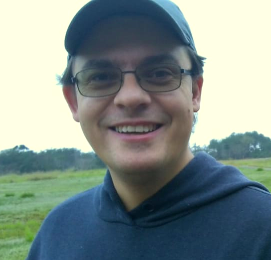

# cfbasz

Welcome!

My name is Carlos Frederico Bastarz. I am a technologist at the National Institute for Space Research ([Instituto Nacional de Pesquisas Espaciais - INPE](https://www.gov.br/inpe/pt-br)) in Brazil. My work interests are numerical weather prediction, data assimilation, ensemble forecasting, model verification and post-processing. You can find some of my work developments in [GAD-DIMNT-CPTEC](https://github.com/GAD-DIMNT-CPTEC) and [GAM-DIMNT-CPTEC](https://github.com/GAM-DIMNT-CPTEC) organizations.

## Academics

You can find my full CV [here](cv.md).

I earned my Master and PhD degrees at the National Institute of Space Research studying Meteorology and Data Assimilation, in 2010 and 2017, respectively. My undergraduation is in Mathematics teaching.

* My publications can be found on my Google Scholar page [here](https://scholar.google.com.br/citations?user=26GiFgoAAAAJ&hl=pt-BR);
* My Lattes CV is [here](http://lattes.cnpq.br/2410960909883784);
* My ORCID is [here](https://orcid.org/0000-0001-5402-7979);
* My Web Of Science profile is [here](https://www.webofscience.com/wos/author/record/HHC-1947-2022);
* My Research Gate profile is [here](https://www.researchgate.net/profile/Carlos_Bastarz).

## Work Experience

* Atmospheric data assimilation with methods like PSAS, 3DVar, EnKF and 3DEnVar;
* NMC method for the calculation of the background error covariance matrix for the Brazilian Atmospheric Model ([BAM](https://journals.ametsoc.org/view/journals/wefo/31/5/waf-d-16-0062_1.xml)), for the sigma and hybrid vertical coordinates;
* Ensemble Forecasting using an EOF based perturbation method for the BAM model ([link](https://github.com/GAD-DIMNT-CPTEC/oensMB09));
* Objective model evaluation using the [SCANTEC](https://github.com/GAM-DIMNT-CPTEC/SCANTEC) and [SCANPLOT](https://github.com/GAM-DIMNT-CPTEC/SCANPLOT) softwares.

## Outside Work

I am most interested in personal computing in general and I also like to tinker with electronics devices. I am also a music passionate (classic rock and metal) and I also play guitar (acoustic and electric).

## Contact

The best way to reach me is via [email](mailto:cfbastarz@gmail.com).

---

Never let yourself be diverted, either by what you wish to believe, or what you think could have beneficent social effects if it were believed; but look only and solely at what are the facts.
 
 -- <cite>Bertrand Russel</cite>

