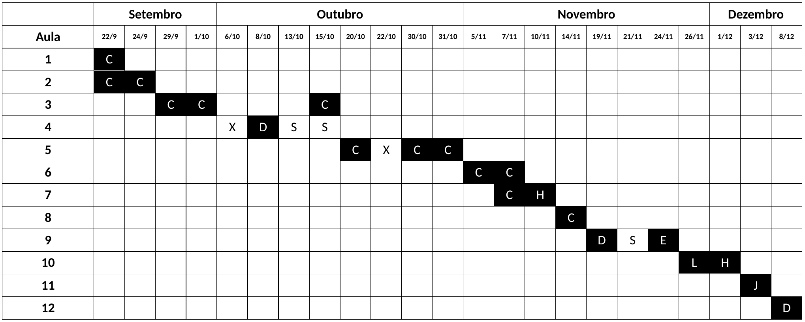

# MET 563-3

Site do curso "Introdução à Assimilação de Dados (MET 563-3)" do Programa de Pós-Graduação em Meteorologia (PGMET) do INPE.

## Horário das Aulas

* 🗓️ Segundas e quartas-feiras, das 14h30 às 16h30.

## Repositório do Curso

* 🐙 [https://github.com/cfbastarz/MET563-3](https://github.com/cfbastarz/MET563-3)

## Assuntos

### 1. Apresentação da Disciplina

* &#128073; Slides: [HTML](https://cfbastarz.github.io/MET563-3/Aula1_IntroAssimDados.html)

### 2. Motivação

* Equação de Análise Empírica: Por que a assimilação de dados fornece uma estimativa ótima? 
    * &#128073; Aula 1 - [HTML](https://cfbastarz.github.io/MET563-3/Aula1_IntroAssimDados-AnlEmpiricaUni.html)
    * &#128073; Aula 2 - [HTML](https://cfbastarz.github.io/MET563-3/Aula1_IntroAssimDados-AnlEmpiricaMulti.html)

#### Atividades

* 🎲 Atividade 1: Equação de Análise Empírica Univariada - [Google Colab](https://colab.research.google.com/github/cfbastarz/MET563-3/blob/main/atividade_01_equacao_de_analise_empirica.ipynb)
* 🎲 Atividade 2: Equação de Análise Empírica Multivariada - [Google Colab](https://colab.research.google.com/github/cfbastarz/MET563-3/blob/main/atividade_02_equacao_de_analise_empirica_multi.ipynb)

### 3. Histórico da Assimilação de Dados

* Revisão do histórico da assimilação de dados e das motivações para o seu desenvolvimento, passando pelos métodos de análise empíricos de Bergthórsson e Döös (1959) e Cressman (1955) - Método de Correções Sucessivas e Gandin (1963) - Interpolação Ótima
    * &#128073; Aula 3 - [HTML](https://cfbastarz.github.io/MET563-3/Aula2_IntroAssimDados-Historico.html)
    * &#128073; Aula 4 - [HTML](https://cfbastarz.github.io/MET563-3/Aula2_IntroAssimDados-Historico-Cressman.html)
    * &#128073; Linha do Tempo da Assimilação de Dados no CPTEC - [PDF](https://cfbastarz.github.io/MET563-3/figs/linha_do_tempo_gad-2024-v3.pdf)
    * &#128073; Aula 6 - [HTML](https://cfbastarz.github.io/MET563-3/Aula2_IntroAssimDados-Historico-Gandin.html)

#### Leitura Complementar

* Livro - Richardson, 1922: [Weather Prediction by Numerical Process](https://x.gd/4ccVg)
* Artigo - Panofsky, 1949: [Objective Weather Map Analysis](https://x.gd/sBmUk)
* Artigo - Bergthórsson e Döös, 1955: [Numerical Weather Map Analysis](https://x.gd/qmxVS)
* Artigo - Cressman, 1959: [An Operational Objective Analysis System](https://x.gd/DkMuD)
* Livro - Gandin, 1963: [Objective Analysis of Meteorological Fields](https://x.gd/68xV7)
* Review - Gandin, 1963: [Objective Analysis of Meteorological Fields](https://x.gd/TKtbo)
* Post - Lynch, 2015: [Richardson’s Fantastic Forecast Factory](https://x.gd/TWX3t)
* Webpage - [NOAA Teletypes](https://www.circuitousroot.com/artifice/telegraphy/tty/gallery/noaa/index.html)
* Wikipedia - [IBM 704](https://en.wikipedia.org/wiki/IBM_704)
* Wikipedia - [Baudot Code](https://en.wikipedia.org/wiki/Baudot_code)

#### Atividades

* 🎲 Atividade 3: Análise de Bergthórsson e Döös (1955) - [Google Colab](https://colab.research.google.com/github/cfbastarz/MET563-3/blob/main/atividade_03_analise_bd1955_1d2d.ipynb)
* 🎲 Atividade 4: Análise de Cressman (1959) - [Google Colab](https://colab.research.google.com/github/cfbastarz/MET563-3/blob/main/atividade_04_analise_cressman1959_1d2d.ipynb)
* 🎲 Atividade 5: Análise de Gandin (1963) - [Google Colab](https://colab.research.google.com/github/cfbastarz/MET563-3/blob/main/atividade_05_analise_gandin1963_1d2d.ipynb)

### 4. O Sistema Global de Observações Meteorológicas

* O que é o Sistema Global de Observações Meteorlógicas
* Os diferentes tipos de observações (_in situ_, por sensoriamento remoto e plataformas oceânicas) 
* O fluxo de dados operacional no CPTEC para a Assimilação de Dados
* Controle de Qualidade das Observações

  * &#128073; Aula 5 - [PPT](https://cfbastarz.github.io/MET563-3/Herdies_aula_1_Observ_2025.pptx)

#### Leitura Complementar

* WMO - [Global Observing System (GOS)](https://x.gd/cAeQP)
* Newsletter ECMWF - [How to evolve global observing systems](https://x.gd/tat27)
* Wikipedia - [Global Climate Observing System](https://x.gd/hDtcP)

### 5. Método Variacional

* Cálculo variacional
* Revisão de Álgebra Linear (Operações com Matrizes)
    * &#128073; Aula 7 - [HTML](https://cfbastarz.github.io/MET563-3/Aula2_IntroAssimDados-Variacional.html)
* Introdução do método 3DVar
    * Histórico e desenvolvimento 
    * Características principais 
    * PSAS
    * FGAT
    
* Componentes 
    * Método de minimização da função custo do 3DVar
    * Matriz de Covariâncias dos Erros de Previsão
    * ~~Modelo de Transferência Radiativa~~
    * ~~Controle de Qualidade~~
* Visão geral sobre o método 4DVar
* Atividades realizadas no CPTEC com o método 3DVar
    * &#128073; Aula 8 - [HTML](https://cfbastarz.github.io/MET563-3/Aula2_IntroAssimDados-Variacional-pt2.html)

#### Leitura Complementar

* RMetS - [Analysis methods for numerical weather prediction](https://x.gd/Wonbz)
* ECMWF - [Variational Data Assimilation: Theory and Overview](https://x.gd/l32iw)
* ECMWF - [Assimilation techniques (3): 3dVar](https://x.gd/PSYXM)
* JMSJ - [Unified Notation for Data Assimilation: Operational, Sequential and Variational](https://x.gd/CeGlr)

#### Atividades

* 🎲 Atividade 6: Método do Gradiente Descendente - [Google Colab](https://colab.research.google.com/github/cfbastarz/MET563-3/blob/main/atividade_06_metodo_gradiente_descendende.ipynb)

###  6. Métodos Baseados em Conjuntos (EnKF et al.)

* Introdução ao método EnKF
* Histórico e desenvolvimento
* Características principais 
* Inflation e Localization
* Visão geral sobre os esquemas derivados
* Atividades realizadas no CPTEC com o método LETKF
    * &#128073; Aula 9 - [HTML](https://cfbastarz.github.io/MET563-3/Aula1_IntroAssimDados-BayesRecursivo.html)

#### Leitura Complementar

* Artigo - Kalman (1960): [A New Approach to Linear Filteringand Prediction Problems](https://x.gd/SFMtF)
* Artigo - Evensen (1994): [Sequential data assimilation with a nonlinear quasi-geostrophic model using Monte Carlo methods to forecast error statistics](https://x.gd/mwsNYs)
* Artigo - Evensen (2003):  [The Ensemble Kalman Filter: Theoretical Formulation and PracticalImplementation](https://x.gd/qqgdn)
* Artigo - Katzfuss et al. (2016): [Understanding the Ensemble Kalman Filter](https://x.gd/szoC9)
* Artigo - Sapucci et al. (2016): [Inclusion of Global Navigation Satellite System radio occultation data intoCenter for Weather Forecast and Climate Studies Local Ensemble TransformKalman Filter (LETKF) using the Radio Occultation Processing Package as anobservation operator](https://x.gd/4pvTm)
* Video - [Ensemble Kalman Filter](https://youtu.be/UeFsEOGz_cc?si=nn_CFlLiZ6nUirXg)
* Webpage - [Ensemble Kalman methods](https://x.gd/6QBtu)
* Webpage - [Abakcus](https://x.gd/j3zcN)

#### Atividades

* 🎲 Atividade 7: Filtro de Bayes Recursivo - [Google Colab](https://colab.research.google.com/github/cfbastarz/MET563-3/blob/main/atividade_07_filtro_bayes_recursivo.ipynb)

### 7. Métodos Híbridos

* Introdução aos métodos híbridos
* Histórico e desenvolvimento
* Sistema 3DVar híbrido
    * Características principais
    * Extensão da variável de controle
    * Ciclo de assimilação de dados 3DVar híbrido
* 3DVar híbrido baseado no modelo BAM e no GSI
    * Determinação do conjunto de previsões inicial
    * Cálculo da matriz **B** climatológica
    * Experimentos com observação única
    * Experimentos com o sistema 3DVar híbrido

* &#128073; Aula 10 - [HTML](https://cfbastarz.github.io/MET563-3/Aula2_IntroAssimDados-Hibrido.html)
* &#128073; Aula 11 - [PDF](https://cfbastarz.github.io/MET563-3/aula_HM_10112025-1.pdf)

#### Leitura Complementar

* Artigo - Penny (2014): [The Hybrid Local Ensemble Transform Kalman Filter](https://x.gd/Wr3FC)
* Artigo - Penny et al. (2015): [A Hybrid Global Ocean Data Assimilation System at NCEP](https://x.gd/23qgl)
* Artigo - Bonavita et al. (2015): [EnKF and Hybrid Gain Ensemble Data Assimilation. Part II: EnKF and Hybrid Gain Results](https://x.gd/RxI8a)
* Artigo - Azevedo et al. (2020): [Dynamically weighted hybrid gain data assimilation: perfect model testing](https://x.gd/Pw8qC)

### 8. Frameworks de Assimilação de Dados

* Apresentação dos frameworks GSI e JEDI para a assimilação de dados operacional
* Paradigmas de desenvolvimento do JEDI 
* Atividades realizadas no CPTEC com o GSI e JEDI

* &#128073; Aula 12 - [HTML](https://cfbastarz.github.io/MET563-3/Aula2_IntroAssimDados-FrameworksAD.html)

### 9. Assimilação de Dados Regional

* ~~Apresentação sobre as particularidades de um sistema de assimilação de dados regional~~
* Assimilação de Dados de Radar
* Desenvolvimentos realizados no CPTEC

  * &#128073; Aula 13 - [PDF](https://cfbastarz.github.io/MET563-3/radar_data_assimilation2025.pdf)

### 10. Impacto e Experimentos de Sistemas Observacionais

* Visão geral sobre a metodologia e a ferramenta para o estudo de impacto das observações empregada no sistema de assimilação de dados do CPTEC
* Impacto da Assimilação das Observações: ferramenta readDiag
  * Impacto total
  * Impacto fracionário
  * Impacto benéfico fracionário
* Radiâncias e impacto de observação
* Observing System Experiment (OSE) 

  * &#128073; Aula 14 - [PDF](https://cfbastarz.github.io/MET563-3/aula_pgmet26112025.pdf)
  * &#128073; Aula 15 - [PDF](https://cfbastarz.github.io/MET563-3/aula_OSE_01122025.pdf)

#### Leitura Complementar

* Artigo - Todling (2013): [Comparing Two Approaches for Assessing Observation Impact](https://x.gd/c7pk7)
* Artigo - Azevedo et al. (2017): [Observing System Experiments in a 3DVAR Data Assimilation System at CPTEC/INPE](https://x.gd/mJ7uC)
* Artigo - Diniz e Todling (2019): [Assessing the impact of observations in a multi-year reanalysis](https://x.gd/KGtrz)
* Artigo - Diniz et al. (2020): [A Brief Assessment of the Impact of Nearly 40 Years of Assimilated Observations Over the Amazon Basin](https://x.gd/JzmzG)
* Artigo - Ingleby et al. (2020): [The Impact of COVID-19 on Weather Forecasts: A Balanced View](https://x.gd/NG2hV)
* Artigo - Viana e de Mattos (2024): [Assessing the Impact of Observations on the Brazilian Global Atmospheric Model (BAM) Using Gridpoint Statistical Interpolation (GSI) System](https://x.gd/Fx527)
* Dissertação - Diniz (2012): [Impacto das Observações nas Previsões de Curto Prazo](https://x.gd/lKlZC)
* Dissertação - Azevedo (2014): [Uso da Técnica de OSE para Avaliar o Impacto de Observações no Sistema de Assimilação de Dados Global Variacional Tridimensional do CPTEC/INPE](https://x.gd/haWSU)

### 11. Assimilação de Dados de Superfície

* Apresentação sobre a assimilação de dados de superfície, seus impactos e desafios
* Desenvolvimentos realizados no CPTEC

~~### 12. Reanálises~~

~~* O que é reanálise~~
~~* Reanálise como ferramenta de validação de modelos numéricos~~
~~* Desenvolvimentos realizados no CPTEC com reanálise regional~~

### 13. Aula Extra - O formato BUFR e PREPBUFR

* Conceitos gerais dos formatos BUFR e PREPBUFR e softwares disponíveis
* Instalação e utilização de ferramentas BUFR
* Programação e desenvolvimento

  * &#128073; Aula 16 - [PDF](https://cfbastarz.github.io/MET563-3/2025_curso_BUFR-PREPBUFR_PGMET.pdf)

#### Leitura Complementar

* WMO: [Manual on Codes](https://x.gd/w2Jx7)
* WMO: [ET-Data Meetings](https://x.gd/XGHbN)
* WMO: [Code Registry](https://x.gd/TMkfG)
* GitHub: [INPE-MBUFRTOOLS](https://x.gd/kyblj)

## Cronograma de Aulas

**Legenda:**

* X: Não houve aula
* S: Seminários dos alunos
* C: Aula Carlos
* D: Aula Dirceu
* E: Aula Éder
* H: Aula Helena
* J: Aula João
* L: Aula Liviany
* S: Aula Sérgio

---

⚠️  This work is licensed under <a href="https://creativecommons.org/licenses/by-nc-sa/4.0/">CC BY-NC-SA 4.0</a>
