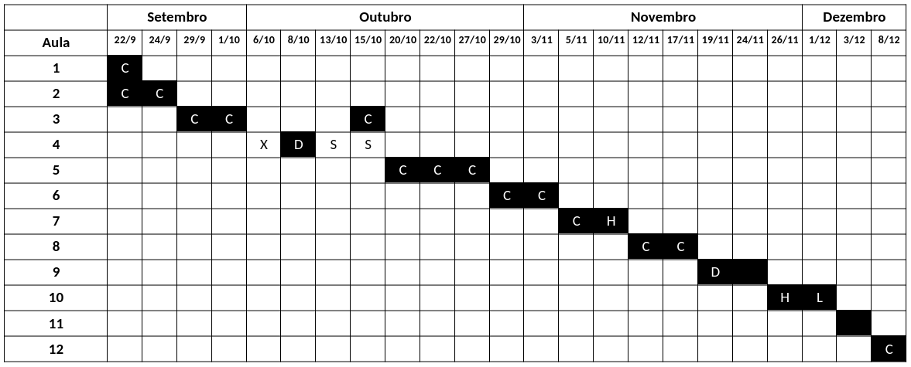

# MET 563-3

Site do curso "Introdução à Assimilação de Dados (MET 563-3)" do Programa de Pós-Graduação em Meteorologia (PGMET) do INPE.

## Horário das Aulas

* 🗓️ Segundas e quartas-feiras, das 14h30 às 16h30.

## Repositório do Curso

* 🐙 [https://github.com/cfbastarz/MET563-3](https://github.com/cfbastarz/MET563-3)

## Assuntos

### 1. Apresentação da Disciplina

* &#128073; Slides: [PDF](https://cfbastarz.github.io/MET563-3/Aula1_IntroAssimDados.pdf) | [HTML](https://cfbastarz.github.io/MET563-3/Aula1_IntroAssimDados.html)

### 2. Motivação

* Equação de Análise Empírica: Por que a assimilação de dados fornece uma estimativa ótima? 
    * &#128073; Aula 1 - [PDF](https://cfbastarz.github.io/MET563-3/Aula1_IntroAssimDados-AnlEmpiricaUni.pdf) | [HTML](https://cfbastarz.github.io/MET563-3/Aula1_IntroAssimDados-AnlEmpiricaUni.html)
    * &#128073; Aula 2 - [PDF](https://cfbastarz.github.io/MET563-3/Aula1_IntroAssimDados-AnlEmpiricaMulti.pdf) | [HTML](https://cfbastarz.github.io/MET563-3/Aula1_IntroAssimDados-AnlEmpiricaMulti.html)

#### Atividades

* 🎲 Atividade 1: Equação de Análise Empírica Univariada - [Google Colab](https://colab.research.google.com/github/cfbastarz/MET563-3/blob/main/atividade_01_equacao_de_analise_empirica.ipynb) | [Repositório](https://github.com/cfbastarz/MET563-3/blob/main/atividade_01_equacao_de_analise_empirica.ipynb)
* 🎲 Atividade 2: Equação de Análise Empírica Multivariada - [Google Colab](https://colab.research.google.com/github/cfbastarz/MET563-3/blob/main/atividade_02_equacao_de_analise_empirica_multi.ipynb) | [Repositório](https://github.com/cfbastarz/MET563-3/blob/main/atividade_02_equacao_de_analise_empirica.ipynb)

### 3. Histórico da Assimilação de Dados

* Revisão do histórico da assimilação de dados e das motivações para o seu desenvolvimento, passando pelos métodos de análise empíricos de Bergthórsson e Döös (1959) e Cressman (1955) - Método de Correções Sucessivas e Gandin (1963) - Interpolação Ótima
    * &#128073; Aula 3 - [PDF](https://cfbastarz.github.io/MET563-3/Aula2_IntroAssimDados-Historico.pdf) | [HTML](https://cfbastarz.github.io/MET563-3/Aula2_IntroAssimDados-Historico.html)
    * &#128073; Aula 4 - [PDF](https://cfbastarz.github.io/MET563-3/Aula2_IntroAssimDados-Historico-Cressman.pdf) | [HTML](https://cfbastarz.github.io/MET563-3/Aula2_IntroAssimDados-Historico-Cressman.html)
    * &#128073; Linha do Tempo da Assimilação de Dados no CPTEC - [PDF](https://cfbastarz.github.io/MET563-3/figs/linha_do_tempo_gad-2024-v3.pdf)

#### Leitura Complementar

* Livro - Richardson, 1922: [Weather Prediction by Numerical Process](https://x.gd/4ccVg)
* Artigo - Panofsky, 1949: [Objective Weather Map Analysis](https://x.gd/sBmUk)
* Artigo - Bergthórsson e Döös, 1955: [Numerical Weather Map Analysis](https://x.gd/qmxVS)
* Artigo - Cressman, 1959: [An Operational Objective Analysis System](https://x.gd/DkMuD)
* Livro - Gandin, 1963: [Objective Analysis of Meteorological Fields](https://x.gd/68xV7)
* Review - Gandin, 1963: [Objective Analysis of Meteorological Fields](https://x.gd/TKtbo)
* Post - Lynch, 2015: [Richardson’s Fantastic Forecast Factory](https://x.gd/TWX3t)
* Webpage - [NOAA Teletypes](https://www.circuitousroot.com/artifice/telegraphy/tty/gallery/noaa/index.html)
* Wikipedia - [IBM 704](https://en.wikipedia.org/wiki/IBM_704)
* Wikipedia - [Baudot Code](https://en.wikipedia.org/wiki/Baudot_code)

#### Atividades

* 🎲 Atividade 3: Análise de Bergthórsson e Döös (1955) - [Google Colab](https://colab.research.google.com/github/cfbastarz/MET563-3/blob/main/atividade_03_analise_bd1955_1d2d.ipynb) | [Repositório](https://github.com/cfbastarz/MET563-3/blob/main/atividade_03_analise_bd1955_1d2d.ipynb)
* 🎲 Atividade 4: Análise de Cressman (1959) - [Google Colab](https://colab.research.google.com/github/cfbastarz/MET563-3/blob/main/atividade_04_analise_cressman1959_1d2d.ipynb) | [Repositório](https://github.com/cfbastarz/MET563-3/blob/main/atividade_04_analise_cressman1959_1d2d.ipynb)

### 4. O Sistema Global de Observações Meteorológicas

* O que é o Sistema Global de Observações Meteorlógicas
* Os diferentes tipos de observações (_in situ_, por sensoriamento remoto e plataformas oceânicas) 
* O fluxo de dados operacional no CPTEC para a Assimilação de Dados
* Controle de Qualidade das Observações

  * &#128073; Aula 5 - [PDF]()

#### Leitura Complementar

* WMO - [Global Observing System (GOS)](https://x.gd/cAeQP)
* Newsletter ECMWF - [How to evolve global observing systems](https://x.gd/tat27)
* Wikipedia - [Global Climate Observing System](https://x.gd/hDtcP)

### 5. Método Variacional

* Revisão de Álgebra Linear (Operações com Matrizes)
* Introdução do método 3DVar
    * Histórico e desenvolvimento 
    * Características principais 
    * PSAS
    * FGAT
* Componentes 
    * Método de minimização da função custo do 3DVar
    * Matriz de Covariâncias dos Erros de Previsão
    * Modelo de Transferência Radiativa
    * Controle de Qualidade
* Visão geral sobre o método 4DVar
* Atividades realizadas no CPTEC com o método 3DVar

###  6. Métodos Baseados em Conjuntos (EnKF et al.)

* Introdução ao método EnKF
* Histórico e desenvolvimento
* Características principais 
* Inflation e Localization
* Visão geral sobre os esquemas derivados
* Atividades realizadas no CPTEC com o método LETKF

### 7. Métodos Híbridos (Ensemble-Variacional)

* Introdução ao método híbrido ensemble-variacional 3DEnVar
* Histórico e desenvolvimento
* Características principais
* Atividades realizadas no CPTEC com o método ensemble-variacional 3DEnVar

### 8. Frameworks de Assimilação de Dados

* Apresentação dos principais frameworks abertos para a assimilação de dados operacional: GSI e JEDI
* Paradigmas de desenvolvimento do JEDI 
* Atividades realizadas no CPTEC com o GSI e JEDI

### 9. Assimilação de Dados Regional

* Apresentação sobre as particularidades de um sistema de assimilação de dados regional
* Assimilação de Dados de Radar
* Desenvolvimentos realizados no CPTEC

### 10. Impacto e Experimentos de Sistemas Observacionais

* Visão geral sobre a metodologia e a ferramenta para o estudo de impacto das observações empregada no sistema de assimilação de dados do CPTEC
* Impacto da Assimilação das Observações
* Observing System Experiment (OSE) e Observing System Simulation Experiment (OSSE)

### 11. Assimilação de Dados de Superfície

* Apresentação sobre a assimilação de dados de superfície, seus impactos e desafios
* Desenvolvimentos realizados no CPTEC

### 12. Reanálises

* O que é reanálise
* Reanálise como ferramenta de validação de modelos numéricos
* Desenvolvimentos realizados no CPTEC com reanálise regional

## Cronograma de Aulas

**Legenda:**

* X: não houve aula
* S: Seminários dos alunos
* D: Aula Dirceu
* H: Aula Helena
* L: Aula Liviany
